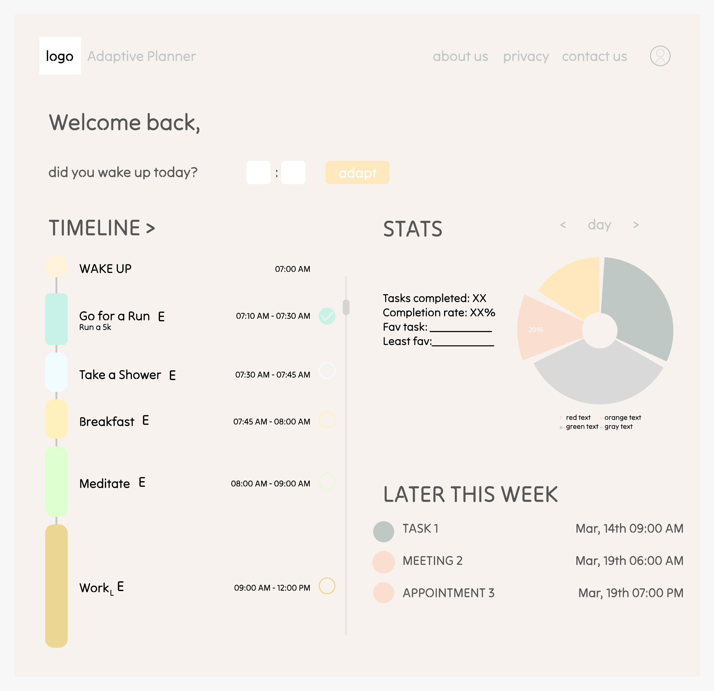

# Adaptive Planner Web, Mobile & Desk App 🌵

Hi-Yume is a game studio created by 4 siblings, their main goal is to make games that are fun and provide humanitarian showcase and aid to those in need.

## 🚀 Tech Stack
- **Frontend:** I'm creating this app using Next.Js, React, Typescript and Turbopack.
- **Backend:** Node.js for backend and supabase for authintication, storage and server-side rendering.
- **Styling:** For styling I'm using Tailwind CSS, Shadcn UI, Lucide React and some custom css modules.

## ✨ Features
- It has a linked system of tasks, events and goals making productivity attainable.
- There are Bucket List for future goals and dreams, notes to keep track everything.
- Various themes with the ability to make your own custom theme.

## 🧑‍💻 Technical
- Adaptive scheduling to keep productivity high and achieve more.
- Connection between goals, tasks and events to keep you on track.
- Connecting to your google calendar to get your events.

## 📸 Homepage
